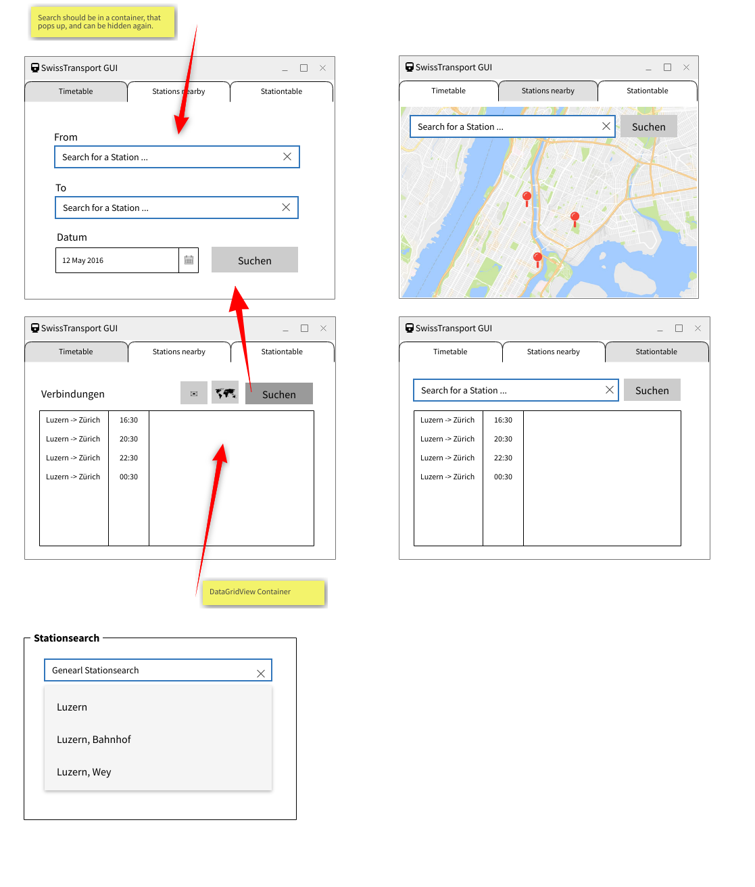
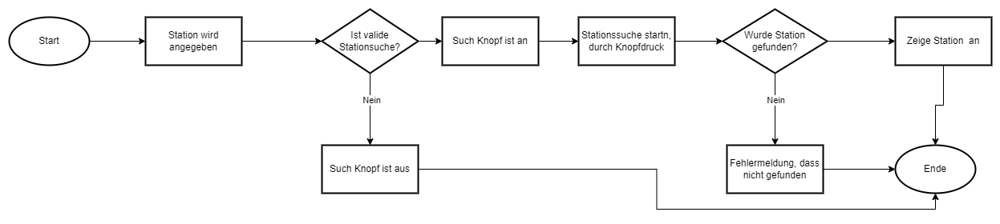
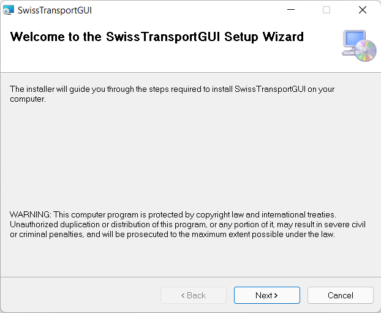
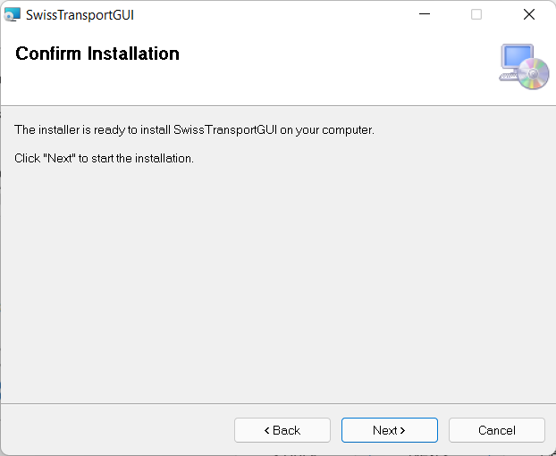
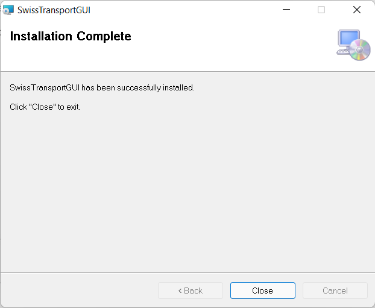
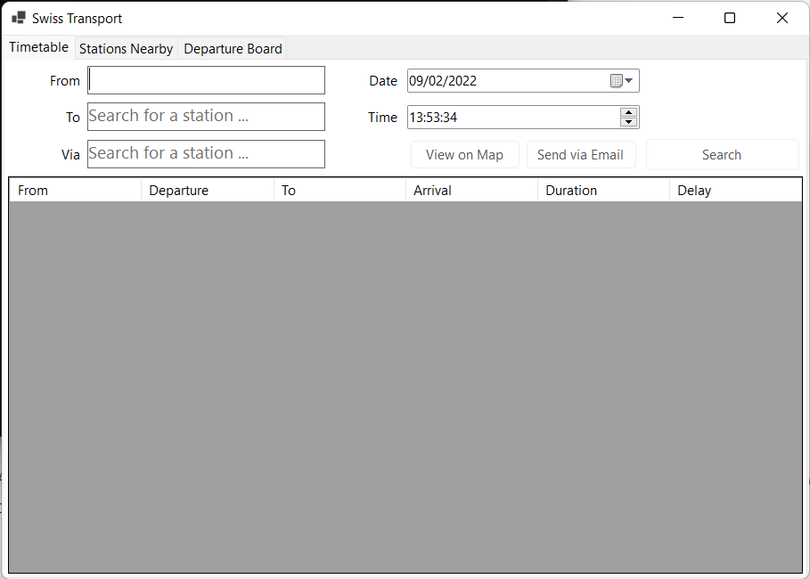
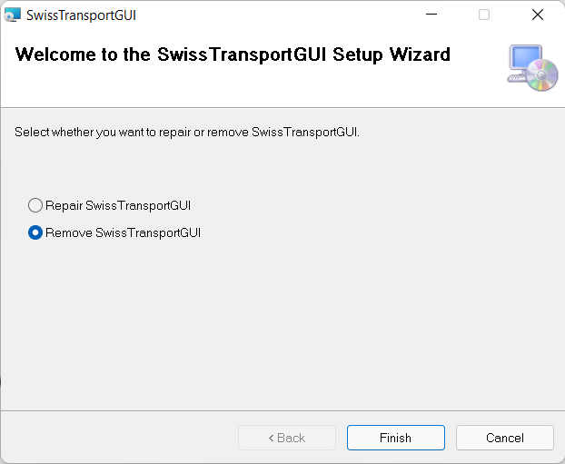

# SwissTransportGUI🚂

Enea Krähenbühl, 9.2.2022

# Inhaltsverzeichnis

[TOC]

# Einleitung

Dokumentation zum SwissTransportGUI aus dem ÜK M318. Die Applikation dient dem abrufen von ÖV-Verbindungen sowie dem anzeigen von diesen auf einer Karte und dem senden der Verbindung via Email an eine andere Person.

Diese Dokumentation dient dem Programmierer als Referenz bezüglich User-Stories zu diesem Projekt, Mock-Ups sowie als auch anderen Diagrammen welche zur Planung und Wartung dieses Projektes dienen. Auch abgebildet sind Known-Issues, Testfälle und das Integrations-Testprotokoll.

# Bekannte Fehler (Bugs🐞)

### Passwörter in Datei

Im EmailSendingController befinden sich drei Variabeln von sensitiver Natur, welche mit Base64 encoded wurden, damit man deren Inhalt nicht gleich sieht.

Jedoch besteht hier ein Verbesserungspotenzial.

### Verbindungsabfrage mit Via langsam

Es scheint, dass bei Verbindungsabfragen mit dem zusätzlichen Parameter `via`, dass diese Abfrage entsprechend länger dauert, dies liegt aus meiner Sicht beim API-Betreiber.

### Email Provider Account Disabled

Es kann sein, dass mein Email provider GitHub scannt und somit sehen wird, dass ich mal Credentials in der Repo rumliegen hatte und dann meinen Account disabled.

# Planungsdokumente

## Mockups

### Timetable - Tab

Dies ist der erste Screen welcher dem Benutzer bei Start der Applikation angezeigt wird. Hier kann dieser nach einer Verbindung zwischen A und B (optional via C) suchen. Nach erfolgreicher Suche werden die 4 nächsten Verbindungen angezeigt. Ursprünglich war geplant eine Art PopUp zu machen um zu Suchen jedoch passte dies nicht ins Gesamtbild der Applikation.

### Stations Nearby - Tab

In diesem Tab kann der Benutzer nach Stationen in der Nähe anderer Stationen suchen. Diese werden dann auf einer Karte angezeigt.

### Departure Board - Tab

In diesem Tab werden die nächsten Abfahrten einer Station angezeigt in einer Tabelle. Der Benutzer kann diese Station mit dem Suchfeld oben suchen.

### Search - Component

Dies ist ein Komponent welchen ich durch die ganze UI der Applikation immer wieder verwendete und darum diesen auch als eigens "Ding" hier beschreibe.

## Ablaufdiagramm _Station Suchen_

Die Station wird im Eingabefeld eingegeben und danach validiert, sobald sie valide ist wird der Such-Knopf aktiviert. Wenn der Benutzer den Such-Knopf klickt, dann wird ein API-Request gesendet und die Station wenn gefunden, angezeigt.

# User Roles

## Benutzer

Der Anwender dieser Applikation, welcher keine besonderen technischen Fähigkeiten aufweist.

# User Stories

| Id   | Titel                   | Beschrieb                                                    | Abnahmekriterien                                             | Priorität | Erfüllt |
| ---- | ----------------------- | ------------------------------------------------------------ | ------------------------------------------------------------ | --------- | ------- |
| 1    | Verbindung abfragen     | Als Benutzer möchte ich die nächsten 4 Verbindungen zwischen Start- und Endstation angezeigt bekommen. | - Die nächsten 4 Verbindungen werden angezeigt. ✅ - Start- und Endstation können eingegeben werden. ✅ | 1         | ✅       |
| 2    | Station suchen          | Als Benutzer möchte ich eine Station suchen können.          | - Die Station wird gefunden. ✅ - Der Stationsname kann eingegeben werden. ✅ - Die Station wird angezeigt. ✅ | 1         | ✅       |
| 3    | Abfahrtstafel           | Als Benutzer möchte ich alle ausgehenden Abfahrten einer Station anzeigen können. | - Die Ausgehenden Verbindungen werden angezeigt. ✅ - Die Verbindungen werden im Tabellenformat angezeigt. ✅ | 1         | ✅       |
| 4    | Suchvorschläge          | Als Benutzer möchte ich während dem eintippen Vorschläge bezüglich meiner Eingabe bekommen. | - Bei jedem Buchstaben werden die neusten Vorschläge angezeigt. ✅ - Die Vorschläge werden unter dem Suchfeld angezeigt. ✅ | 2         | ✅       |
| 5    | Zukünftige Verbindungen | Als Benutzer möchte ich bei Eingabe von Datum und Uhrzeit die Verbindungen angezeigt bekommen. | - Ich kann das Datum mit Datepicker eingeben. ✅ - Ich kann die Uhrzeit mit Uhrzeit-Picker eingeben ✅ - Die zukünftigen Verbindungen werden angezeigt ✅ | 2         | ✅       |
| 6    | Station auf Karte       | Als Benutzer möchte ich auf einer Karte sehen,  wo sich die Station befindet. | - Station wird auf Karte mit einem Pin markiert ✅ - Die Karte wird angezeigt. ✅ | 3         | ✅       |
| 7    | Station in Nähe         | Als Benutzer möchte ich auf einer Karte Stationen in meiner Nähe sehen. | - Die Stationen in meiner Nähe werden angezeigt ✅ - Die Stationen werden mit Pins markiert ✅ | 3         | ✅       |
| 8    | Verbindung Teilen       | Als Benutzer möchte ich eine Verbindung per Mail teilen können. | - Auf Knopfdruck wird ein Mail-Dialog geöffnet, welcher ein Mail sendet. ✅ - Verbindungsinformationen werden strukturiert im Email übertragen. ✅ | 3         | ✅       |
| 9    | Via / Route anzeigen    | Als Benutzer möchte ich eine Verbindung via einer anderen Station suchen können. | - Die Via-Station kann eingegeben werden. ✅ - Die Verbindung wird angezeigt. ✅ | 3         | ✅       |

# Integrationstests

## Testfälle

**Testplan**

Tester: 
Datum: 
Dokumentversion: 
App-Version:
Installationsanleitung ist im nächsten Kapitel zu finden.

**Abfahrtstafel anzeigen**

Anforderungen: Programm gestartet, aktive Internetverbindung

| Schritt | Aktion | Erwartetes Resultat | Erfüllt | abweichendes Resultat |
| --- | --- | --- |--- |--- |
| 1 | "Departure Board" Tab wird angeklickt | - Auf dem Bildschirm wird der "Departure Board" Tab angezeigt | ||
| 2 | Stationsname "Neuchâtel" wird eingegeben. | - Während dem Tippen erscheinen Vorschläge zum eingetippten. | ||
| 3 | Der Such-Knopf wird gedrückt | - Die Abfahrtstafel erscheint in der Tabelle unter der Suchbox. | ||

**Verbindung suchen**

Anforderungen: Programm gestartet, aktive Internetverbindung

| Schritt | Aktion | Erwartetes Resultat | Erfüllt | abweichendes Resultat |
| --- | --- | --- |--- |--- |
| 1 | "Timetable" Tab wird angeklickt | - Auf dem Bildschirm erscheint der "Timetable" Tab. | ||
| 2 | Im Feld "From" wird "Zür" eingegeben | - Während dem Tippen erscheint eine Liste von Vorschlägen. | ||
| 3 | Aus den Vorschlägen wird "Zürich HB" durch klicken ausgewählt. | - Im "From" Feld steht nun "Zürich HB" | ||
| 4 | Im Feld "To" wird "Sion" eingegeben | - Während dem Tippen erscheint eine Liste von Vorschlägen. | ||
| 5 | "Suchen"-Knopf wird gedrückt | - 4 Verbindungen zwischen Zürich HB und Sion werden in der Tabelle nach dem Suchen angezeigt. | ||

**Stationen in der Nähe anzeigen**

Anforderungen: Programm gestartet, aktive Internetverbindung

| Schritt | Aktion | Erwartetes Resultat | Erfüllt | abweichendes Resultat |
| --- | --- | --- |--- |--- |
| 1 | "Stations Nearby" Tab wird angeklickt | - Auf dem Screen erscheint ein Suchfeld, ein Such-Knopf und eine dazugehörige Karte | ||
| 2 | Im Suchfeld wird "B" eingegeben | - Es erscheinen Suchvorschläge zum eingegebenen | ||
| 3 | Aus den Vorschlägen wird "Bern" ausgewählt. | - Im Suchfeld erscheint nun Bern - Der Such-Knopf wurde eingeschaltet | ||
| 4 | Suchknopf wird gedrückt | - Auf der Karte erscheint die Station "Bern" als blauer Pin - Alle anliegenden Stationen erschein als rote Pins - Beim "hovern" über einen Pin erscheint der Name der dazugehörigen Station | ||

**Verbindung auf Karte anzeigen**

Anforderungen: Test _Verbindung suchen_ davor ausgeführt, aktive Internetverbindung

| Schritt | Aktion | Erwartetes Resultat | Erfüllt | abweichendes Resultat |
| --- | --- | --- |--- |--- |
| 1 | In der Tabelle wird die zweit oberste Verbindung ausgewählt durch klicken | - Die Reihe wird blau markiert - Der Button "View on Map" wird angeschaltet - Der Button "Share by Email" wird angeschaltet | ||
| 2 | Der Button "View on Map" wird angeklickt | - Es erscheint ein zweites Fenster über dem vorherigen mit der Verbindung visualisiert auf einer Karte | ||

**Verbindung per Email versenden**

Anforderungen: Test _Verbindung suchen_ davor ausgeführt, aktive Internetverbindung

| Schritt | Aktion | Erwartetes Resultat | Erfüllt | abweichendes Resultat |
| --- | --- | --- |--- |--- |
| 1 | In der Tabelle wird oberste Verbindung ausgewählt durch klicken | - Die Reihe wird blau markiert - Der Button "View on Map" wird angeschaltet - Der Button "Share by Email" wird angeschaltet | ||
| 2 | Der Button "Send By Email" wird angeklickt | - Es erscheint ein Dialog mit zwei Textfeldern | ||
| 3 | Im Dialog werden "Tester" bei Name und "test@enea.tech" bei Email eingegeben. | - Der Done Button wird aktiviert | ||
| 4 | Der Done Button wird geklickt | - Der Eingabe-Dialog verschwindet - Ein neuer Dialog erscheint mit der Nachricht, dass unsere Email versendet wurde | ||
| 5 | Postfach überprüfen | - Email kam an von "swisstransportgui@mail.3n3a.ch" mit dem Subject "Your Connection" | ||

**keine Internetverbindung vorhanden**

Anforderungen: **keine** Internetverbindung

| Schritt | Aktion | Erwartetes Resultat | Erfüllt | abweichendes Resultat |
| --- | --- | --- |--- |--- |
| 1 | Programm wird gestartet | - Dialog der anzeigt, dass keine Internetverbindung vorhanden ist | ||

## Testprotokoll

**Testplan**

Tester: Enea Krähenbühl
Datum: 9.2.2022
Dokumentversion: v1.0.0
App-Version: v1.0.0
Installationsanleitung ist im nächsten Kapitel zu finden.

**Abfahrtstafel anzeigen**

Anforderungen: Programm gestartet, aktive Internetverbindung

| Schritt | Aktion | Erwartetes Resultat | Erfüllt | abweichendes Resultat |
| --- | --- | --- |--- |--- |
| 1 | "Departure Board" Tab wird angeklickt | - Auf dem Bildschirm wird der "Departure Board" Tab angezeigt | ✅ |-|
| 2 | Stationsname "Neuchâtel" wird eingegeben. | - Während dem Tippen erscheinen Vorschläge zum eingetippten. | ✅ |-|
| 3 | Der Such-Knopf wird gedrückt | - Die Abfahrtstafel erscheint in der Tabelle unter der Suchbox. | ✅ |-|

**Verbindung suchen**

Anforderungen: Programm gestartet, aktive Internetverbindung

| Schritt | Aktion | Erwartetes Resultat | Erfüllt | abweichendes Resultat |
| --- | --- | --- |--- |--- |
| 1 | "Timetable" Tab wird angeklickt | - Auf dem Bildschirm erscheint der "Timetable" Tab. | ✅ |-|
| 2 | Im Feld "From" wird "Zür" eingegeben | - Während dem Tippen erscheint eine Liste von Vorschlägen. | ✅ |-|
| 3 | Aus den Vorschlägen wird "Zürich HB" durch klicken ausgewählt. | - Im "From" Feld steht nun "Zürich HB" | ✅ |-|
| 4 | Im Feld "To" wird "Sion" eingegeben | - Während dem Tippen erscheint eine Liste von Vorschlägen. | ✅ |-|
| 5 | "Suchen"-Knopf wird gedrückt | - 4 Verbindungen zwischen Zürich HB und Sion werden in der Tabelle nach dem Suchen angezeigt. | ✅ |-|

**Stationen in der Nähe anzeigen**

Anforderungen: Programm gestartet, aktive Internetverbindung

| Schritt | Aktion | Erwartetes Resultat | Erfüllt | abweichendes Resultat |
| --- | --- | --- |--- |--- |
| 1 | "Stations Nearby" Tab wird angeklickt | - Auf dem Screen erscheint ein Suchfeld, ein Such-Knopf und eine dazugehörige Karte | ✅ |-|
| 2 | Im Suchfeld wird "B" eingegeben | - Es erscheinen Suchvorschläge zum eingegebenen | ✅ |-|
| 3 | Aus den Vorschlägen wird "Bern" ausgewählt. | - Im Suchfeld erscheint nun Bern - Der Such-Knopf wurde eingeschaltet | ✅ |-|
| 4 | Suchknopf wird gedrückt | - Auf der Karte erscheint die Station "Bern" als blauer Pin - Alle anliegenden Stationen erschein als rote Pins - Beim "hovern" über einen Pin erscheint der Name der dazugehörigen Station | ✅ |-|

**Verbindung auf Karte anzeigen**

Anforderungen: Test _Verbindung suchen_ davor ausgeführt, aktive Internetverbindung

| Schritt | Aktion | Erwartetes Resultat | Erfüllt | abweichendes Resultat |
| --- | --- | --- |--- |--- |
| 1 | In der Tabelle wird die zweit oberste Verbindung ausgewählt durch klicken | - Die Reihe wird blau markiert - Der Button "View on Map" wird angeschaltet - Der Button "Share by Email" wird angeschaltet | ✅ ||
| 2 | Der Button "View on Map" wird angeklickt | - Es erscheint ein zweites Fenster über dem vorherigen mit der Verbindung visualisiert auf einer Karte | ✅ |(ZoomLevel bei langer Verbindung tweaken)|

**Verbindung per Email versenden**

Anforderungen: Test _Verbindung suchen_ davor ausgeführt, aktive Internetverbindung

| Schritt | Aktion | Erwartetes Resultat | Erfüllt | abweichendes Resultat |
| --- | --- | --- |--- |--- |
| 1 | In der Tabelle wird oberste Verbindung ausgewählt durch klicken | - Die Reihe wird blau markiert - Der Button "View on Map" wird angeschaltet - Der Button "Send via Email" wird angeschaltet | ✅ |-|
| 2 | Der Button "Send Via Email" wird angeklickt | - Es erscheint ein Dialog mit zwei Textfeldern | ✅ |-|
| 3 | Im Dialog werden "Tester" bei Name und "test@enea.tech" bei Email eingegeben. | - Der Done Button wird aktiviert | ✅ |-|
| 4 | Der Done Button wird geklickt | - Der Eingabe-Dialog verschwindet - Ein neuer Dialog erscheint mit der Nachricht, dass unsere Email versendet wurde | ✅ |-|
| 5 | Postfach überprüfen | - Email kam an von "swisstransportgui@3n3a.ch" mit dem Subject "Your Connection" | ✅ |-|

**keine Internetverbindung vorhanden**

Anforderungen: **keine** Internetverbindung

| Schritt | Aktion | Erwartetes Resultat | Erfüllt | abweichendes Resultat |
| --- | --- | --- |--- |--- |
| 1 | Programm wird gestartet | - Dialog der anzeigt, dass keine Internetverbindung vorhanden ist | ✅ |-|

# Installation

**Anforderungen**:

* Windows 10 oder höher
* .NET 4.7 SDK Installiert
* 64-bit

## Installationsanleitung

1. `Installer-v1.0.0-x64.msi` von Github-Release runterladen.

2. Installer ausführen

3. Auf _Next klicken_

   

4. Wieder auf _Next_ klicken

   

5. Nochmals auf _Next_ klicken

	

7. Bei der Frage nach _Administratorrechten_ auf _Ja_ klicken

8. Auf _Fertig_ klicken

	

9. Die Applikation kann nun mit Klick auf die Windowstaste unten links und der Suche nach _SwissTransportGUI_ gestartet werden.
	
	

## Deinstallationsanleitung

1. Zur Deinstallation wird der heruntergeladene Installer nochmals geöffnet und danach `Remove SwissTransportGUI` ausgewählt.
	
	

2. Bei Nachfrage des Systems nach Administratorrechten **Ja** auswählen
3. Anschliessend wird die Applikation deinstalliert.

# Zusätzliche Informationen

* Für die Stationen in der Nähe wurde eine andere API benutzt. [Dokumentation Search.ch Timetable API](https://timetable.search.ch/api/help)
* [Anleitung zum kreieren eines Installers](https://docs.microsoft.com/en-us/answers/questions/256664/is-it-possible-to-create-a-setup-filemsi-in-visual.html)
* Zusätzliche Deployment Doku in `DEV-NOTES.md`