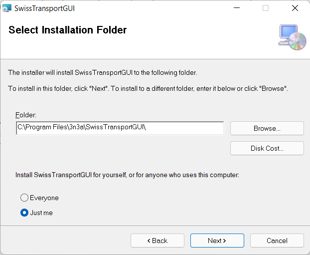

# SwissTransportGUI🚂

Enea Krähenbühl, 9.2.2022

# Inhaltsverzeichnis

[TOC]

# Einleitung

Dokumentation zum SwissTransportGUI aus dem ÜK M318. Die Applikation dient dem abrufen von ÖV-Verbindungen sowie dem anzeigen von diesen auf einer Karte und dem senden der Verbindung via Email an eine andere Person.

Diese Dokumentation dient dem Programmierer als Referenz bezüglich User-Stories zu diesem Projekt, Mock-Ups sowie als auch anderen Diagrammen welche zur Planung und Wartung dieses Projektes dienen. Auch abgebildet sind Known-Issues, Testfälle und das Integrations-Testprotokoll.

# Bekannte Fehler (Bugs🐞)

### Passwörter in Datei

Im EmailSendingController befinden sich drei Variabeln von sensitiver Natur, welche mit Base64 encoded wurden, damit man deren Inhalt nicht gleich sieht.

Jedoch besteht hier ein Verbesserungspotenzial.

### Verbindungsabfrage mit Via langsam

Es scheint, dass bei Verbindungsabfragen mit dem zusätzlichen Parameter `via`, dass diese Abfrage entsprechend länger dauert, dies liegt aus meiner Sicht beim API-Betreiber.

# Planungsdokumente

## Mockups

### Timetable - Tab

Dies ist der erste Screen welcher dem Benutzer bei Start der Applikation angezeigt wird. Hier kann dieser nach einer Verbindung zwischen A und B (optional via C) suchen. Nach erfolgreicher Suche werden die 4 nächsten Verbindungen angezeigt. Ursprünglich war geplant eine Art PopUp zu machen um zu Suchen jedoch passte dies nicht ins Gesamtbild der Applikation.

### Stations Nearby - Tab

In diesem Tab kann der Benutzer nach Stationen in der Nähe anderer Stationen suchen. Diese werden dann auf einer Karte angezeigt.

### Departure Board - Tab

In diesem Tab werden die nächsten Abfahrten einer Station angezeigt in einer Tabelle. Der Benutzer kann diese Station mit dem Suchfeld oben suchen.

### Search - Component

Dies ist ein Komponent welchen ich durch die ganze UI der Applikation immer wieder verwendete und darum diesen auch als eigens "Ding" hier beschreibe.

## Ablaufdiagramm _Station Suchen_

Die Station wird im Eingabefeld eingegeben und danach validiert, sobald sie valide ist wird der Such-Knopf aktiviert. Wenn der Benutzer den Such-Knopf klickt, dann wird ein API-Request gesendet und die Station wenn gefunden, angezeigt.

# User Roles

## Benutzer

Der Anwender dieser Applikation, welcher keine besonderen technischen Fähigkeiten aufweist.

# User Stories

| Id   | Titel                   | Beschrieb                                                    | Abnahmekriterien                                             | Priorität | Erfüllt |
| ---- | ----------------------- | ------------------------------------------------------------ | ------------------------------------------------------------ | --------- | ------- |
| 1    | Verbindung abfragen     | Als Benutzer möchte ich die nächsten 4 Verbindungen zwischen Start- und Endstation angezeigt bekommen. | - Die nächsten 4 Verbindungen werden angezeigt. ✅ - Start- und Endstation können eingegeben werden. ✅ | 1         | ✅       |
| 2    | Station suchen          | Als Benutzer möchte ich eine Station suchen können.          | - Die Station wird gefunden. ✅ - Der Stationsname kann eingegeben werden. ✅ - Die Station wird angezeigt. ✅ | 1         | ✅       |
| 3    | Abfahrtstafel           | Als Benutzer möchte ich alle ausgehenden Abfahrten einer Station anzeigen können. | - Die Ausgehenden Verbindungen werden angezeigt. ✅ - Die Verbindungen werden im Tabellenformat angezeigt. ✅ | 1         | ✅       |
| 4    | Suchvorschläge          | Als Benutzer möchte ich während dem eintippen Vorschläge bezüglich meiner Eingabe bekommen. | - Bei jedem Buchstaben werden die neusten Vorschläge angezeigt. ✅ - Die Vorschläge werden unter dem Suchfeld angezeigt. ✅ | 2         | ✅       |
| 5    | Zukünftige Verbindungen | Als Benutzer möchte ich bei Eingabe von Datum und Uhrzeit die Verbindungen angezeigt bekommen. | - Ich kann das Datum mit Datepicker eingeben. ✅ - Ich kann die Uhrzeit mit Uhrzeit-Picker eingeben ✅ - Die zukünftigen Verbindungen werden angezeigt ✅ | 2         | ✅       |
| 6    | Station auf Karte       | Als Benutzer möchte ich auf einer Karte sehen,  wo sich die Station befindet. | - Station wird auf Karte mit einem Pin markiert ✅ - Die Karte wird angezeigt. ✅ | 3         | ✅       |
| 7    | Station in Nähe         | Als Benutzer möchte ich auf einer Karte Stationen in meiner Nähe sehen. | - Die Stationen in meiner Nähe werden angezeigt ✅ - Die Stationen werden mit Pins markiert ✅ | 3         | ✅       |
| 8    | Verbindung Teilen       | Als Benutzer möchte ich eine Verbindung per Mail teilen können. | - Auf Knopfdruck wird ein Mail-Dialog geöffnet, welcher ein Mail sendet. ✅ - Verbindungsinformationen werden strukturiert im Email übertragen. ✅ | 3         | ✅       |
| 9    | Via / Route anzeigen    | Als Benutzer möchte ich eine Verbindung via einer anderen Station suchen können. | - Die Via-Station kann eingegeben werden. ✅ - Die Verbindung wird angezeigt. ✅ | 3         | ✅       |

# Integrationstests

## Testfälle

**Testplan**

Tester: 
Datum: 
Dokumentversion: 
App-Version:
Installationsanleitung ist im nächsten Kapitel zu finden.

**Abfahrtstafel anzeigen**

Anforderungen: Programm gestartet, aktive Internetverbindung

| Schritt | Aktion | Erwartetes Resultat | Erfüllt | abweichendes Resultat |
| --- | --- | --- |--- |--- |
| 1 | "Departure Board" Tab wird angeklickt | - Auf dem Bildschirm wird der "Departure Board" Tab angezeigt | ||
| 2 | Stationsname "Neuchâtel" wird eingegeben. | - Während dem Tippen erscheinen Vorschläge zum eingetippten. | ||
| 3 | Der Such-Knopf wird gedrückt | - Die Abfahrtstafel erscheint in der Tabelle unter der Suchbox. | ||

**Verbindung suchen**

Anforderungen: Programm gestartet, aktive Internetverbindung

| Schritt | Aktion | Erwartetes Resultat | Erfüllt | abweichendes Resultat |
| --- | --- | --- |--- |--- |
| 1 | "Timetable" Tab wird angeklickt | - Auf dem Bildschirm erscheint der "Timetable" Tab. | ||
| 2 | Im Feld "From" wird "Zür" eingegeben | - Während dem Tippen erscheint eine Liste von Vorschlägen. | ||
| 3 | Aus den Vorschlägen wird "Zürich HB" durch klicken ausgewählt. | - Im "From" Feld steht nun "Zürich HB" | ||
| 4 | Im Feld "To" wird "Sion" eingegeben | - Während dem Tippen erscheint eine Liste von Vorschlägen. | ||
| 5 | "Suchen"-Knopf wird gedrückt | - 4 Verbindungen zwischen Zürich HB und Sion werden in der Tabelle nach dem Suchen angezeigt. | ||

**Stationen in der Nähe anzeigen**

Anforderungen: Programm gestartet, aktive Internetverbindung

| Schritt | Aktion | Erwartetes Resultat | Erfüllt | abweichendes Resultat |
| --- | --- | --- |--- |--- |
| 1 | "Stations Nearby" Tab wird angeklickt | - Auf dem Screen erscheint ein Suchfeld, ein Such-Knopf und eine dazugehörige Karte | ||
| 2 | Im Suchfeld wird "B" eingegeben | - Es erscheinen Suchvorschläge zum eingegebenen | ||
| 3 | Aus den Vorschlägen wird "Bern" ausgewählt. | - Im Suchfeld erscheint nun Bern - Der Such-Knopf wurde eingeschaltet | ||
| 4 | Suchknopf wird gedrückt | - Auf der Karte erscheint die Station "Bern" als blauer Pin - Alle anliegenden Stationen erschein als rote Pins - Beim "hovern" über einen Pin erscheint der Name der dazugehörigen Station | ||

**Verbindung auf Karte anzeigen**

Anforderungen: Test _Verbindung suchen_ davor ausgeführt, aktive Internetverbindung

| Schritt | Aktion | Erwartetes Resultat | Erfüllt | abweichendes Resultat |
| --- | --- | --- |--- |--- |
| 1 | In der Tabelle wird die zweit oberste Verbindung ausgewählt durch klicken | - Die Reihe wird blau markiert - Der Button "View on Map" wird angeschaltet - Der Button "Share by Email" wird angeschaltet | ||
| 2 | Der Button "View on Map" wird angeklickt | - Es erscheint ein zweites Fenster über dem vorherigen mit der Verbindung visualisiert auf einer Karte | ||

**Verbindung per Email versenden**

Anforderungen: Test _Verbindung suchen_ davor ausgeführt, aktive Internetverbindung

| Schritt | Aktion | Erwartetes Resultat | Erfüllt | abweichendes Resultat |
| --- | --- | --- |--- |--- |
| 1 | In der Tabelle wird oberste Verbindung ausgewählt durch klicken | - Die Reihe wird blau markiert - Der Button "View on Map" wird angeschaltet - Der Button "Share by Email" wird angeschaltet | ||
| 2 | Der Button "Send By Email" wird angeklickt | - Es erscheint ein Dialog mit zwei Textfeldern | ||
| 3 | Im Dialog werden "Tester" bei Name und "test@enea.tech" bei Email eingegeben. | - Der Done Button wird aktiviert | ||
| 4 | Der Done Button wird geklickt | - Der Eingabe-Dialog verschwindet - Ein neuer Dialog erscheint mit der Nachricht, dass unsere Email versendet wurde | ||
| 5 | Postfach überprüfen | - Email kam an von "swisstransportgui@mail.3n3a.ch" mit dem Subject "Your Connection" | ||

**keine Internetverbindung vorhanden**

Anforderungen: **keine** Internetverbindung

| Schritt | Aktion | Erwartetes Resultat | Erfüllt | abweichendes Resultat |
| --- | --- | --- |--- |--- |
| 1 | Programm wird gestartet | - Dialog der anzeigt, dass keine Internetverbindung vorhanden ist | ||

## Testprotokoll

# Installation

**Anforderungen**:

* Windows 10 oder höher
* .NET 4.7 SDK Installiert
* 64-bit

## Installationsanleitung

1. `Installer-v1.0.0-x64.msi` von Github-Release runterladen.

2. Installer ausführen

3. Auf _Next klicken_

   

4. Wieder auf _Next_ klicken

   

5. Nochmals auf _Next_ klicken

	

7. Bei der Frage nach _Administratorrechten_ auf _Ja_ klicken

8. Auf _Fertig_ klicken

	

9. Die Applikation kann nun mit Klick auf die Windowstaste unten links und der Suche nach _SwissTransportGUI_ gestartet werden.
	
	

## Deinstallationsanleitung

1. Zur Deinstallation wird der heruntergeladene Installer nochmals geöffnet und danach `Remove SwissTransportGUI` ausgewählt.
	
	

2. Bei Nachfrage des Systems nach Administratorrechten **Ja** auswählen
3. Anschliessend wird die Applikation deinstalliert.

# Zusätzliche Informationen

* Für die Stationen in der Nähe wurde eine andere API benutzt. [Dokumentation Search.ch Timetable API](https://timetable.search.ch/api/help)
* [Anleitung zum kreieren eines Installers](https://docs.microsoft.com/en-us/answers/questions/256664/is-it-possible-to-create-a-setup-filemsi-in-visual.html)
* Zusätzliche Deployment Doku in `DEV-NOTES.md`